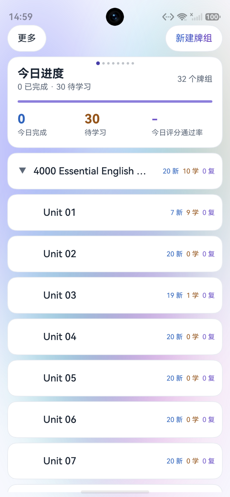
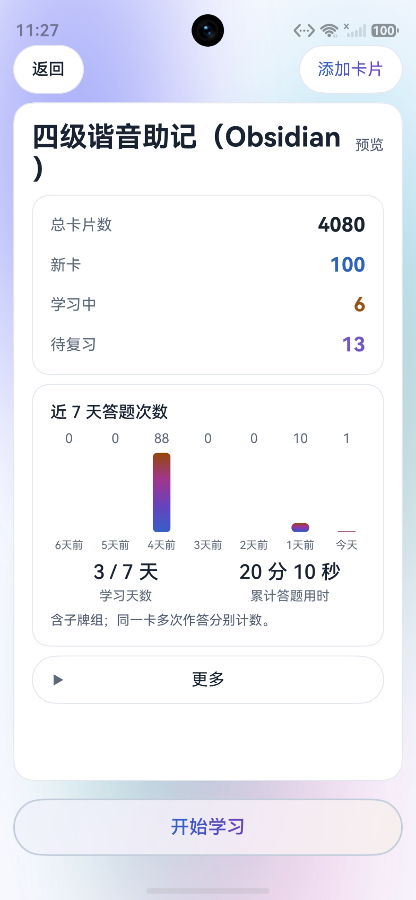
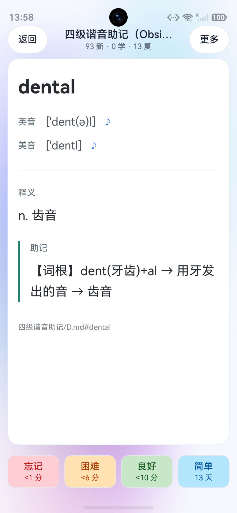
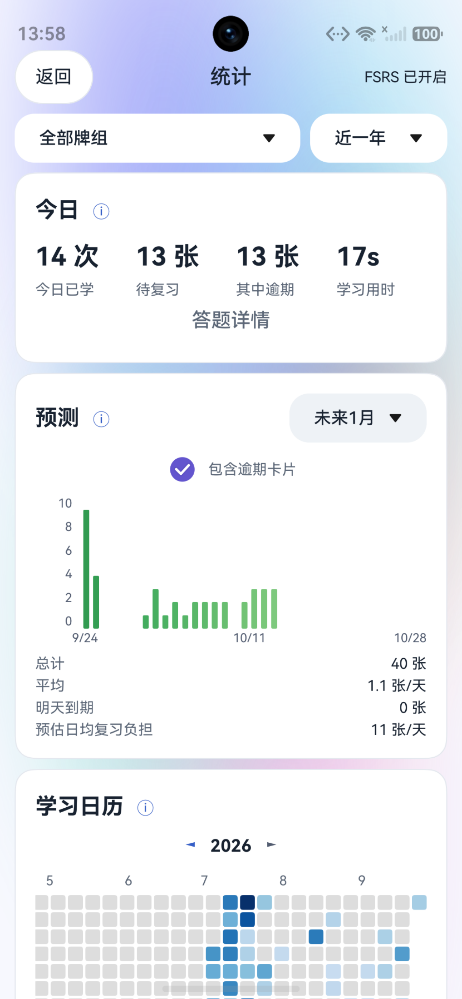
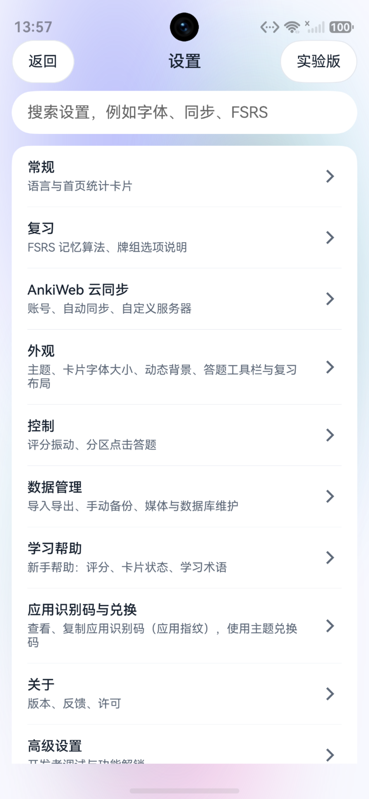
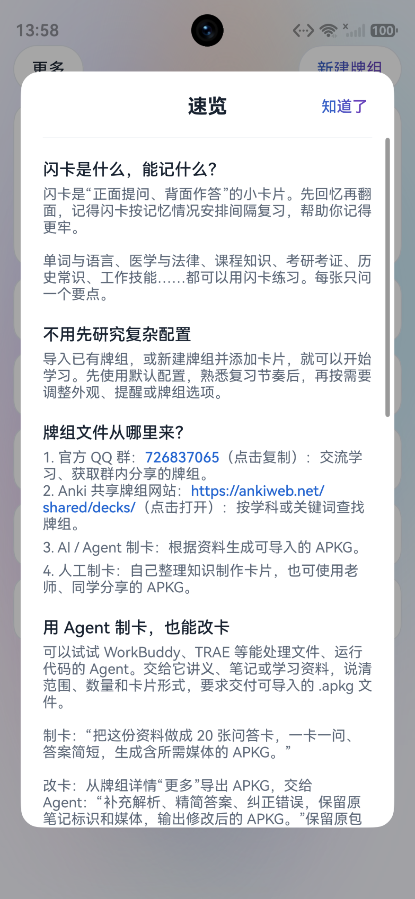

# jidecards（记得闪卡）

[](https://github.com/wuweiyouzuoju/jidecards-anki-harmonyos/actions/workflows/ci.yml)
[](LICENSE)
[](https://www.harmonyos.com/)

jidecards（中文名“记得闪卡”）是面向 HarmonyOS NEXT 的开源闪卡学习应用，支持鸿蒙手机、平板和电脑。导入 Anki 牌组后，可以离线复习、编辑资料、查看学习统计，并通过 AnkiWeb 同步。原生界面由 ArkTS/ArkUI 实现，集合、模板渲染、调度和同步复用锁定版本的 Anki Rust Core。

**当前源码版本：2.9.9（versionCode 2990）**

应用可在[华为应用市场](https://appgallery.huawei.com/app/detail?id=com.jide.kapian&channelId=SHARE&source=appshare)搜索“记得闪卡”下载安装。仓库构建版本的唯一事实来源是 [AppScope/app.json5](AppScope/app.json5)；商店实际上架版本以 AppGallery 页面为准。

官网：[jidecards.com](https://jidecards.com/) · [下载与功能](https://jidecards.com/works/jidecards/) · [鸿蒙 Anki 使用指南](https://jidecards.com/guides/harmonyos-anki/)

开发入口：[贡献指南](CONTRIBUTING.md) · [更新记录](CHANGELOG.md) · [文档导航](docs/README.md) · [问题反馈](https://github.com/wuweiyouzuoju/jidecards-anki-harmonyos/issues)

> jidecards 是独立开源项目，与 Ankitects、AnkiWeb 或 AnkiDroid 无关，也未获得其认可。

## 目录

- [项目特点](#项目特点)
- [应用截图](#应用截图)
- [安装与使用](#安装与使用)
- [数据与隐私](#数据与隐私)
- [从源码构建](#从源码构建)
- [项目结构与文档](#项目结构与文档)
- [参与贡献](#参与贡献)
- [版本与发布](#版本与发布)
- [许可证与第三方声明](#许可证与第三方声明)

## 项目特点

### 复习与调度

- 复用 Anki 26.05 Rust Core，提供兼容的集合、模板渲染和调度基础。
- 支持 FSRS、目标记忆保持率、牌组选项、四档评分、撤销、埋藏、暂停和学习完成页。
- 提供 FSRS 参数优化、复习负担模拟，以及日切时间、提前学习窗口、时间盒等全局复习偏好；调度仍由 Anki Core 执行。
- 支持普通问答、完形填空、拼写输入、图片遮罩，以及卡片中的图片、音频、MathJax、mhchem 和 MathML。
- 使用原生音频播放器和 HarmonyOS CoreSpeechKit TTS；学习页和卡片预览共享渲染与媒体生命周期。

### 牌组、浏览与统计

- 支持层级牌组、新建、重命名、排序、拖动、别名、隐藏和牌组背景图片。
- 提供 Cards/Notes 浏览、牌组树和标签树、Anki 搜索语法、保存搜索、字段与标签编辑、查找替换及批量操作。
- 支持录音与音频附件、字段查重、笔记类型字段及模板管理；新建和编辑笔记可预览未保存内容、多模板与填空编号。
- 提供学习进度、预测、年历热力图、复习间隔、记忆稳定期、难度、记忆可提取性和新增卡片等统计，并提供 2×4 桌面服务卡片。
- 简洁模式覆盖日常学习；实验模式提供高级调度、笔记类型管理、自定义学习、过滤牌组等能力。

### 同步、导入与维护

- 支持 AnkiWeb 集合与媒体同步、自定义同步端点、TLS 证书、自动同步及全量上传/下载。
- 支持 `.apkg` 牌组导入与导出、`.colpkg` 集合备份与恢复，并可选择媒体和调度信息；提供自动历史备份和恢复列表，历史备份不包含媒体。
- 支持 CSV / TSV / TXT 导入预览、字段映射和重复处理；APKG 导入可配置更新策略，查看进度、取消及结果统计；整库替换提供空间预检和进程中断恢复。详见[数据导入](docs/development/import-data.md)。
- 支持笔记文本和卡片文本导出，适合整理资料或交给其他工具处理；文本导出不包含媒体文件和复习进度。
- 提供媒体引用检查、缺失文件检查、媒体回收站、数据库检查，以及标签和笔记维护工具。
- 选择题 APKG 扩展遵循公开的 [v1 规范](docs/choice-apkg-v1.md)，附带 [制题指南](docs/choice-authoring.md)、[JSON Schema](docs/schemas/choice-source-v1.schema.json) 和[示例牌组](docs/examples/choice-demo.apkg)。

### HarmonyOS 体验

- 提供蓝、绿、紫、青、橙、金、灰七套主题，支持浅色、深色和跟随系统外观。
- 支持学习提醒、中文和 English 界面、可停靠或浮动的答题工具栏、卡片字号设置和动态背景。
- 导航、列表、设置和统计使用 ArkUI；Anki 卡片 HTML/CSS 使用 HarmonyOS Web 组件渲染。

### JIDE 应用内助手（默认隐藏的功能）

JIDE 提供统一的自然语言对话入口，也可以从牌组、浏览或学习页携带当前上下文进入。它通过受控工具协助学习和资料维护：

| 能力 | 当前范围 |
| --- | --- |
| 制卡与改卡 | 生成、编辑字段和标签，选择或新建牌组与笔记类型，预览后确认保存 |
| 资料阅读 | 导入 PDF、办公文档、电子书、文本和图片；PDF 按页读取、系统 OCR、保存资料笔记并标注卡片页码来源 |
| 学习与应用 | 读取学习概览、卡片统计、牌组选项与已接通的界面状态；确认修改部分设置、共享模板和卡片外观 |
| 偏好与计算 | 用户确认保存的长期偏好；本地 JavaScript 纯计算沙箱，不获得文件、网络或卡库权限 |
| 联网 | 独立开关下搜索与读取公开网页；Wikimedia 图片候选可随草稿确认导入 |

卡库修改先生成可编辑草稿，展示字段、标签、目标和影响范围；用户确认后才写入。删除、类型迁移、共享模板等高风险操作需要二次确认，执行前重新检查数据基线。会话支持历史恢复、澄清和预算暂停后的继续。

**当前发布配置默认隐藏 AI 制卡、AI 改卡及其设置入口**。开发者可在设置页的“开发者调试”中解锁；状态由 [ReleaseFeatures.ets](entry/src/main/ets/model/ReleaseFeatures.ets) 持久化，并通过 AppStorage 运行时开关统一控制。应用端联网工具有独立开关，默认关闭；启用并配置搜索密钥后可搜索和读取网页，Provider 内置搜索仍保持关闭。真实 Provider 请求及普通、高风险写入仍需完成实体设备回归，才能重新开放入口；详细能力与限制见[应用内 Agent 说明](docs/development/agent.md)。

## 应用截图

首页牌组、牌组详情、卡片复习与学习统计：

<p align="center">
  
  
  
  
</p>

设置、学习提醒、桌面服务卡片与应用速览：

<p align="center">
  
  
  
  
</p>

<details>
<summary>查看应用内 Agent 截图（需开发者调试解锁）</summary>

从学习页进入 AI 改卡，查看字段草稿并逐项确认写入：

<p align="center">
  
  
  
</p>

</details>

## 安装与使用

### 普通用户

从[华为应用市场](https://appgallery.huawei.com/app/detail?id=com.jide.kapian&channelId=SHARE&source=appshare)安装“记得闪卡”，导入已有 `.apkg` 牌组后即可开始学习。首次使用建议先保留默认设置，熟悉评分和复习节奏后再调整 FSRS、提醒、主题或牌组选项。

### 兼容范围

- 支持搭载 HarmonyOS NEXT 的手机、平板和电脑（含 2-in-1 设备），最低兼容 API 21。
- 支持常用 Anki 牌组格式和牌组自带媒体；不同牌组的自定义模板、插件字段和历史 schema 仍可能存在兼容差异。
- AnkiWeb 同步需要用户自己的 AnkiWeb 账号；自定义同步服务器需要可用的 HTTPS 服务端点。
- Anki 桌面插件、Qt/Python 界面和桌面 LaTeX 运行时不随应用提供。锁定 Core 的隔离往返回归不等于所有桌面端、AnkiDroid、网站和设备组合已验收；具体证据见[核心互通说明](docs/development/core-interop.md)。

## 数据与隐私

卡库、媒体、备份和 JIDE 会话保存在应用本地。同步按用户配置连接 AnkiWeb 或自定义服务器；公告读取和其他在线功能见对应设置及实现。

使用 JIDE 时，发送的消息以及工具提供给模型的卡片字段、资料片段或图片会交给所选模型服务。联网检索会把查询交给所选搜索服务。请按资料内容选择服务和发送范围；模型、搜索及同步凭证不应出现在问题报告或示例牌组中。JIDE 的发布开关、资料限制和确认机制见[应用内 Agent 说明](docs/development/agent.md)。

## 从源码构建

### 环境要求

- Node.js 24.x（与 CI 一致）
- DevEco Studio 6.1.0.860
- HarmonyOS SDK 6.1.0.105，Compatible API 21、Target API 23
- Rust 1.92.0（见 [rust-toolchain.toml](rust-toolchain.toml)）
- `protoc`；主机测试需要 Visual Studio/MSVC，或配有 `cargo-zigbuild` 和 `zig` 的工具链

### 准备 Anki Core

先获取本仓库并进入项目目录：

```bash
git clone https://github.com/wuweiyouzuoju/jidecards-anki-harmonyos.git
cd jidecards-anki-harmonyos
```

Rust 后端锁定 Anki 26.05，提交为 `e64c6b1`。`third_party/` 被 `.gitignore` 排除，不是 Git submodule；首次构建前准备本地源码：

```bash
git clone https://github.com/ankitects/anki.git third_party/anki
git -C third_party/anki checkout --detach e64c6b1
git -C third_party/anki rev-parse --short=7 HEAD
git -C third_party/anki submodule update --init --depth 1 -- ftl/core-repo ftl/qt-repo
```

Anki rslib 由 Ankitects Pty Ltd 及其贡献者提供，并依据 AGPL-3.0-or-later 授权。

### 安装依赖与构建

公共 [build-profile.json5](build-profile.json5) 不保存个人签名材料。复制 [config/signing.example.json](config/signing.example.json) 为 `.local/signing.json`，填入本机已有签名；也可以用 `JIDECARDS_SIGNING_CONFIG` 指向外部 JSON 文件。覆盖安装必须沿用原有签名身份，签名配置和无签名构建说明见[签名文档](docs/development/signing.md)。

```bash
ohpm install
npm ci
npm run doctor
npm run build:app
```

运行完整 Node 契约测试：

```bash
npm test
```

常用验证入口：

```bash
npm run verify -- repo     # 可移植仓库与文档门禁
npm run verify -- native   # Rust 主机测试与原生门禁
npm run verify             # 完整测试、双架构构建与签名 HAP
```

设备验收只能使用 `hdc -t <connect-key> install -r <signed-hap>` 覆盖安装；不要卸载应用或清除用户数据。完整范围见[验证说明](docs/development/verification.md)。

## 项目结构与文档

| 路径 | 内容 |
| --- | --- |
| [entry/src/main/ets/](entry/src/main/ets/) | ArkTS 页面、组件、模型和应用内 Agent |
| [native/](native/) | C++ Node-API 桥接与 Rust FFI |
| [native/agent-sandbox/](native/agent-sandbox/) | 独立的 QuickJS-NG / wasmi 纯计算沙箱与测试 |
| [tools/](tools/) | 测试、诊断、构建和 APKG 工具 |
| [docs/](docs/) | 架构、开发约定、数据格式和验证说明 |
| [PROJECT_CONTEXT.md](PROJECT_CONTEXT.md) | 编程 Agent 的任务入口与事实来源 |
| [AGENTS.md](AGENTS.md) | 仓库开发约定与不变量 |

进一步阅读：

- [文档导航](docs/README.md)
- [当前架构](docs/architecture.md)
- [模块责任与边界](docs/development/ownership.md)
- [开发任务契约](docs/development/task-contract.md)
- [应用内 Agent 说明](docs/development/agent.md)
- [开发状态与发布门禁](docs/DEVELOPMENT_PLAN.md)

## 参与贡献

欢迎通过 [Issues](https://github.com/wuweiyouzuoju/jidecards-anki-harmonyos/issues) 提交问题和建议，通过 [Pull Requests](https://github.com/wuweiyouzuoju/jidecards-anki-harmonyos/pulls) 贡献修复、文档和翻译。问题报告请附应用版本、设备型号、系统版本、复现步骤、预期与实际结果；日志和示例牌组请先移除账号、密钥及个人学习内容。

准备修改代码时先读[贡献指南](CONTRIBUTING.md)，再按[项目任务入口](PROJECT_CONTEXT.md)定位领域文档和验证范围。提交保持一个明确目的，包含相关实现、回归与说明；PR 模板区分自动检查和实际设备验收。

贡献可以从以下方向开始：

- 使用不同 HarmonyOS API/设备进行兼容性回归并报告版本、设备和复现步骤。
- 改进 Anki 牌组导入、公式、媒体、同步和统计的兼容性。
- 完善中英文界面、用户文档、测试和构建工具。
- 在实体设备上验证应用内 Agent 的联网、取消、普通写入和高风险写入边界。

## 版本与发布

当前源码版本由 [AppScope/app.json5](AppScope/app.json5) 中的 `versionName` 和 `versionCode` 定义。查看[更新记录](CHANGELOG.md)及[2.9.9 源码变更说明](docs/releases/2.9.9.md)；历史说明保留在 [docs/releases/](docs/releases/) 中。商店版本与源码版本分别维护，商店版本只在确认上架后更新。

发布前的构建、测试和设备验收要求见[开发状态与发布门禁](docs/DEVELOPMENT_PLAN.md)。CI 检查结果不代替实体设备验收；源码中的能力以当前发布开关为准。

## 许可证与第三方声明

本项目采用 [AGPL-3.0-or-later](LICENSE) 许可。Anki rslib、MathJax、HarmonyOS 组件及其他依赖的版权和许可见 [NOTICE.md](NOTICE.md) 与各自源文件说明。
